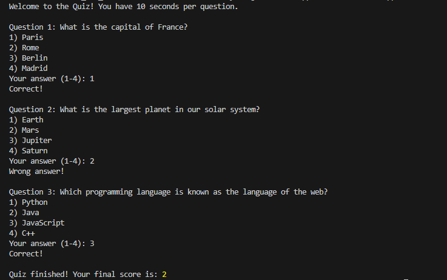

# Quiz Application with Timed Questions

This is a **Quiz Application** built using **Node.js** that leverages the event loop, asynchronous operations, and timers to provide an interactive and time-based quiz experience. The application dynamically handles user input and manages timed events efficiently.

## Features

### Timed Questions:
- **Countdown Timer:** Displays the remaining time for each question.
- **Overall Quiz Timer:** Ensures the quiz completes within a specified duration.

### Asynchronous Question Handling:
- **Non-Blocking Operations:** Ensures questions are asked asynchronously without blocking the main event loop.
- **User Input Handling:** Processes answers asynchronously.

### Dynamic Question Handling:
- **Automatic Progression:** Moves to the next question once the previous one is answered or time expires.
- **Timeout Handling:** Skips unanswered questions when the timer runs out.

### Quiz Termination:
- **Early Completion:** Ends the quiz if all questions are answered before the time expires.
- **Final Score Display:** Shows the user's score at the end of the quiz.

### Error Handling:
- **Invalid Input Handling:** Manages unexpected inputs gracefully.
- **Timeout Management:** Ensures a smooth experience when a user fails to respond in time.

## Technology Stack
- **Backend:** Node.js
- **Timers:** setInterval & setTimeout for time tracking
- **User Input Handling:** Readline Module

## Installation

To run this project locally, follow these steps:

1. Clone the repository:
   ```bash
   git clone https://github.com/Portia-Nelly-Mashaba/Node.Js---Quizz-App.git
   ```
2. Navigate to the project directory:
   ```bash
   cd quiz-app
   ```
3. Install dependencies:
   ```bash
   npm install
   ```
4. Start the application:
   ```bash
   node index.js
   ```

## Screenshots

### Quiz Start



## License
This project is licensed under the MIT License.


